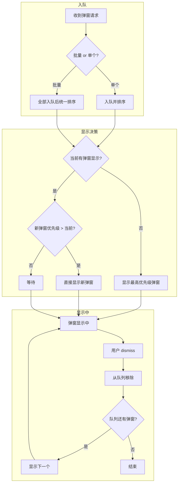

# 弹窗设计规范

本文档记录 CJPopupAction 库的设计规范和实现要点。

---

## 目录

- 一、blankView 传入式设计
- 二、布局方式设计
- 三、对含遮罩的整个弹出视图的创建设计
- 四、动画优化
- 五、多弹窗堆叠显示颜色设计
- 六、多弹窗堆叠显示顺序设计
- 附：队列管理器设计

---

## 前言

下文只对含遮罩的弹窗进行方案设计。

不含遮罩的不算弹出视图，算视图在其指定的superView上的显示，只是可带动画而已。直接调用 UIView 封装的slide位移方法即可。

位移动画：

```objc
+ (void)cj_slideAnimateView:(UIView *)animatedView
                    forShow:(BOOL)forShow
           withShowDirection:(CJSlideFromDirection)showFromDirection
               animateOffset:(CGFloat)animateOffset
                  completion:(void (^ __nullable)(BOOL finished))completion;
```

展开动画：

```objc
+ (void)cj_expandAnimateView:(UIView *)animatedView
                      forShow:(BOOL)forShow
                withShowFrame:(CGRect)popupViewShowFrame
                    hideFrame:(CGRect)popupViewHideFrame
                    blankView:(nullable UIView *)blankView
                   completion:(void(^)(void))completion;
```


## 一、blankView 传入式设计

### 设计变更

#### 第一阶段：无 blankBGView 遮罩的属性

```objc
- (void)cj_popupInView:(UIView *)popupSuperview
            withOrigin:(CGPoint)popupViewOrigin
                  size:(CGSize)popupViewSize
          showComplete:(void(^)(void))showComplete
      tapBlankComplete:(void(^)(void))tapBlankComplete;
```

- **问题**：无 blankBGView 遮罩的属性，则内部一定固定有blankBGView，或者固定没有。如果突然不要blankBGView做不到。

#### 第二阶段：blankBGColor（内部创建）

```objc
- (void)cj_popupInView:(UIView *)popupSuperview
            withOrigin:(CGPoint)popupViewOrigin
                  size:(CGSize)popupViewSize
          blankBGColor:(nullable UIColor *)blankBGColor  // 只传颜色，nil = 不添加遮罩
          showComplete:(void(^)(void))showComplete
      tapBlankComplete:(void(^)(void))tapBlankComplete;

// 内部实现：根据颜色创建 blankView
if (blankBGColor) {
    UIView *blankView = [[UIView alloc] init];
    blankView.backgroundColor = blankBGColor;
    // 添加到父视图...
}
```

- **nil 含义**：nil = 不添加遮罩
- **问题**：只能设置颜色，无法扩展其他属性（如 showStartAlpha（遮罩初始透明度）、tapAction（自定义点击行为）等）；primitive 类型无法携带更多信息

#### 第三阶段：blankBGModel（内部创建，model 封装）

```objc
// CJPopupBlankModel 定义
@interface CJPopupBlankModel : NSObject
@property (nonatomic, strong) UIColor *color;
@property (nonatomic, assign) CGFloat showStartAlpha;  // 新增：遮罩初始透明度
@property (nonatomic, copy) void(^tapAction)(void);    // 新增：自定义点击行为
+ (instancetype)defaultModel;
@end

// API
- (void)cj_popupInView:(UIView *)popupSuperview
            withOrigin:(CGPoint)popupViewOrigin
                  size:(CGSize)popupViewSize
          blankBGModel:(nullable CJPopupBlankModel *)blankBGModel  // 传 model
          showComplete:(void(^)(void))showComplete
      tapBlankComplete:(void(^)(void))tapBlankComplete;

// 内部实现：根据 model 创建 blankView
if (blankBGModel) {
    UIView *blankView = [[UIView alloc] init];
    blankView.backgroundColor = blankBGModel.color;
    blankView.alpha = blankBGModel.showStartAlpha;
    // 添加点击手势...
    // 添加到父视图...
}
```

- **nil 含义**：nil = 不添加遮罩

- **优势**：解决了第一阶段无法扩展的问题，可以添加 showStartAlpha、tapAction 等属性

- **问题**：
  1. 仍然由内部创建 blankView，无法使用自定义视图。如
  
     ```
     UIBlurEffect *blur = [UIBlurEffect effectWithStyle:UIBlurEffectStyleDark];
     UIVisualEffectView *blurView = [[UIVisualEffectView alloc] initWithEffect:blur];
     [popupSuperview addSubview:effectView];
     [popupSuperview sendSubviewToBack:effectView];
     ```
  
  2. 随着需求增加，model 属性会越来越多，而且每个场景需要的属性不一定相同（如有的需要 showStartAlpha，有的不需要）

#### 第四阶段：blankView（外部传入）

```objc
// UIView 工厂方法（在 UIView+CJBlankView 中）
@interface UIView (CJBlankView)
+ (UIView *)cj_defaultBlankView;
+ (UIView *)cj_blankViewWithColor:(UIColor *)color;
@end

// API
- (void)cj_popupInView:(UIView *)popupSuperview
            withOrigin:(CGPoint)popupViewOrigin
                  size:(CGSize)popupViewSize
            blankView:(nullable UIView *)blankView  // 外部传入 UIView
          showComplete:(void(^)(void))showComplete
      tapBlankComplete:(void(^)(void))tapBlankComplete;

// 内部实现：直接使用传入的 blankView
if (blankView) {
    // 设置 frame 并添加到父视图...
}
```

- **nil 含义**：nil = 不添加遮罩

- **优势**：
  - 解决了第二阶段无法使用自定义视图。如
  
    ```objc
    UIView *blankView = nil;													// nil = 不添加遮罩
    
    UIView *blankView = [UIView cj_defaultBlankView];	// 默认遮罩
    
    UIView *blankView = [[UIView alloc] init];				// 自定义遮罩视图，可带模糊效果遮罩
    UIBlurEffect *blur = [UIBlurEffect effectWithStyle:UIBlurEffectStyleDark];
    UIVisualEffectView *blurView = [[UIVisualEffectView alloc] initWithEffect:blur];
    [blankView addSubview:effectView];
    [blankView sendSubviewToBack:effectView];
    
    // 不需要设置 frame，内部会自动设置
    [popupView cj_popupInView:superview withOrigin:origin size:size
                   blankView:blankView ...];
    ```
  
  - 自身优势：
    1. 完全灵活，可以传入任意 UIView 子类
    2. 预配置，调用前可以完全配置好 blankView
    3. nil 语义清晰，nil = 不添加遮罩
  
- **问题**：无

## 二、布局方式设计

### 1、当前布局设计的问题

**当前流程：**

1. 调用方创建 blankView 和 popupView
2. 调用方传入位置信息（frame）
3. 库把两个视图添加到 superview
4. 库内部通过 frame 更新 popupView 和 blankView 再 superView 里的布局位置（核心是 frame 布局方式）
5. 库执行动画

**问题：**

- 布局交给库内部处理，相当于**把布局方式限制死了**

- 库内部用 frame，调用方就被限制为 frame；库内部用 Masonry，调用方就被限制为 Masonry

- 调用方无法使用自己想要的布局方式

- **尤其是使用 frame 时**，当 superview 大小变化（如屏幕旋转），frame 方式的布局不会自动更新，**导致布局错位（严重问题，不是美观问题）**：

  * **frame 方案的问题详述**：

    * popupView 相对于 superview 的 frame，**一定会有问题**
    * blankView 相对于 superview 的 frame，**如果存在，同样有问题**

  * **frame 方案的适用场景：**
    - frame 方案适用于确定不会发生 superview frame 变化的场景
    - 如果需要支持屏幕旋转等场景，建议使用 Masonry/Auto Layout
    
  * **frame 方案的解决方案：**
  
    - 监听 superview frame 变化，手动更新 popupView 和 blankView 的 frame
    - 但实现麻烦，不如 Auto Layout 自动更新
  
  * **frame 方案的优化方向：**
  
    - 考虑使用 Masonry/Auto Layout 替代 frame 布局
    - 或者提供协议让子类实现 `updateConstraintsForPopupViewWithShow:` 方法

**附：superview 大小变化的场景：**

1. 屏幕旋转（portrait ↔ landscape）— keyWindow 大小会变
2. 分屏多任务（iPad）— 应用窗口大小会变
3. 动态调整 superview（很少见）

### 2、布局的优化思路

**既然两个视图已经创建好了，为什么不把布局也交给外部来处理？**

这样：

1. 调用方创建 blankView 和 popupView
2. **布局也由外部处理** — 调用方可以使用自己想要的布局方式（Frame、Masonry 或其他）
3. 库只负责动画
4. 当效果发生变化时（如屏幕旋转），**外部可以自动调整布局**，而不是被库封装死了

**更自然的流程：外部创建 → 外部布局 → 库执行动画。**

### 3、布局优化的实现

#### 3.1 优化方案的核心

**核心**：创建的时候完成布局约束。同时**更重要的是：提供与其布局方式匹配的布局更新接口。**

```objc
- (void)updateConstraintsForPopupViewWithShow:(BOOL)show;
```

#### 3.2 实现代码类似参考

类似参考 CJPopupCreater 的设计模式：

**CJBottomBlankView 的实现：**

```objc
// 1. init 时用 Masonry 设置初始约束
- (instancetype)initWithPopupView:(UIView *)popupView
                  popupViewHeight:(CGFloat)popupViewHeight
                   tapBlankHandle:(void(^)(CJBottomBlankView *bSelf))tapBlankHandle {
    self = [super initWithTapBlankHandle:...];
    if (self) {
        [self addSubview:popupView];
        [popupView mas_makeConstraints:^(MASConstraintMaker *make) {
            make.left.right.bottom.equalTo(self);
            make.height.mas_equalTo(popupViewHeight);
        }];
    }
    return self;
}

// 2. 提供方法让用户更新约束
- (void)updateConstraintsForPopupViewWithShow:(BOOL)show {
    if (show) {
        [popupView mas_updateConstraints:^(MASConstraintMaker *make) {
            make.bottom.equalTo(self);
        }];
    } else {
        [popupView mas_updateConstraints:^(MASConstraintMaker *make) {
            make.bottom.equalTo(self).offset(popupViewHeight);
        }];
    }
    [popupView.superview layoutIfNeeded];
}
```

### 4、设计的进一步改进

#### 4.1 改进1：使用协议强制实现

当前代码中 `updateConstraintsForPopupViewWithShow:` 只是约定同名方法，没有强制子类实现。更好的设计是使用协议：

```objc
// 协议定义
@protocol CJBlankViewUpdateConstraintsProtocol <NSObject>
- (void)updateConstraintsForPopupViewWithShow:(BOOL)show;
@end

// 基类声明
@interface CJBasePopupBlankView : UIView <CJBlankViewUpdateConstraintsProtocol>
// 子类必须实现 updateConstraintsForPopupViewWithShow:
@end
```

**优势：**

1. 编译时检查，防止子类忘记实现
2. 文档化接口
3. 更规范

---

## 三、对含遮罩的整个弹出视图的创建设计


## 四、需自己将 view 先添加到 superview 的动画优化

> **重要**：本章节的所有动画方法（Base 和 Bind）**都不负责将 view 添加到 superview**，调用方需自行添加：
>
> ```objc
> // 调用方需自行添加
> [superview addSubview:animateView];
> 
> [UIView cj_expandAnimateView:animateView forShow:YES ...];
> ```

### 设计变更

#### 第一阶段：未区分动画类型

早期动画没有明确区分，所有动画都混在一起实现。

#### 第二阶段：区分动画类型

##### 基础：将动画按类型拆分为独立模块，使用类方法

使用类方法而非实例方法的原因：动画是纯变换操作（transform/alpha/frame），不需要访问 view 的内部状态，作为工具方法更清晰。

| 动画类型 | 模块 | 说明 |
|---------|------|------|
| 普通位移 | UIView+CJSlideTransformAnimation | transform 位移，大小不变，位置改变 |
| 3D 位移 | UIView+CJSlideTransformAnimation | 带旋转角度的 3D transform |
| 展开 | UIView+CJExpandFrameAnimation | frame 变化，位置锚定，大小改变 |

```objc
// 普通位移（类方法）
+ (void)cj_slideAnimateView:(UIView *)animatedView
                    forShow:(BOOL)forShow
           withShowDirection:(CJSlideFromDirection)showFromDirection
               animateOffset:(CGFloat)animateOffset
                  completion:(void (^ __nullable)(BOOL finished))completion;

// 3D 位移（类方法）
+ (void)cj_slide3DAnimateView:(UIView *)animatedView
                      forShow:(BOOL)forShow
             withShowDirection:(CJSlideFromDirection)showFromDirection
                 animateOffset:(CGFloat)animateOffset
                   rotateAngle:(CGFloat)rotateAngle
                    completion:(void (^ __nullable)(BOOL finished))completion;

// 展开（类方法）
+ (void)cj_expandAnimateView:(UIView *)animatedView
                      forShow:(BOOL)forShow
                withShowFrame:(CGRect)popupViewShowFrame
                    hideFrame:(CGRect)popupViewHideFrame
                    blankView:(nullable UIView *)blankView
                   completion:(void(^)(void))completion;
```

- **优势**：每种动画类型独立封装，职责清晰；类方法动画逻辑与 view 解耦

#### 第三阶段：show 属性绑定到 view

##### 基础：使用类方法绑定参数

通过 runtime 记录 show 时的属性，hide 时复用，不需要再传一遍参数。使用类方法，动画逻辑与 view 完全解耦：

**普通位移（UIView+CJSlideTransformAnimationBind）：**

```objc
// show：传参数，自动记录
+ (void)cj_showSlideAnimateBindView:(UIView *)view
                    withShowDirection:(CJSlideFromDirection)showFromDirection
                        animateOffset:(CGFloat)animateOffset
                           completion:(void (^ __nullable)(BOOL finished))completion;

// hide：复用 show 时记录的参数
+ (void)cj_hideSlideAnimateBindView:(UIView *)view
                          completion:(void (^ __nullable)(BOOL finished))completion;
```

**3D 位移（UIView+CJSlideTransformAnimationBind）：**

```objc
// show：传参数，自动记录
+ (void)cj_show3DSlideAnimateBindView:(UIView *)view
                    withShowDirection:(CJSlideFromDirection)showFromDirection
                        animateOffset:(CGFloat)animateOffset
                          rotateAngle:(CGFloat)rotateAngle
                           completion:(void (^ __nullable)(BOOL finished))completion;

// hide：复用 show 时记录的参数
+ (void)cj_hide3DSlideAnimateBindView:(UIView *)view
                           completion:(void (^ __nullable)(BOOL finished))completion;
```

**展开（UIView+CJExpandFrameAnimationBind）：**

```objc
// show：传参数，自动记录
+ (void)cj_showExpandAnimateBindView:(UIView *)view
                        withShowFrame:(CGRect)showFrame
                            hideFrame:(CGRect)hideFrame
                            blankView:(nullable UIView *)blankView
                           completion:(void(^)(void))completion;

// hide：复用 show 时记录的参数
+ (void)cj_hideExpandAnimateBindView:(UIView *)view
                           completion:(void(^)(void))completion;
```

- **优势**：hide 时不需要再传 show 的参数，简化调用；类方法使动画逻辑与 view 完全解耦

- **重要**：这些 Bind 动画方法同样**不负责将 view 添加到 superview**，调用方需自行添加

---

## 五、多弹窗堆叠显示颜色设计

### 场景说明

同一个 superview 上同时显示多个弹窗时，每个弹窗持有独立的 blankView，堆叠后会产生视觉叠加效果。

### blankView 堆叠行为

每个弹窗持有独立的 blankView，颜色相同（如 `rgba(0,0,0,0.5)`）。堆叠时多层半透明叠加，视觉上背景会变深——这是半透明叠加的物理效果，不是设计问题。

```
弹窗1 blankView (rgba(0,0,0,0.5))
弹窗2 blankView (rgba(0,0,0,0.5))  ← 视觉上更暗（两层叠加）
弹窗3 blankView (rgba(0,0,0,0.5))  ← 视觉上最暗（三层叠加）
```

### 设计原则

1. **弹窗库不负责队列管理**：库只提供 show/hide 能力，优先级排序和显示顺序由业务层控制
2. **每个弹窗独立持有 blankView**：通过 `self.cjTapView` 关联，互不影响
3. **dismiss 后自然露出下层**：移除顶层 blankView 后，下层 blankView 自然可见

### blankView 颜色控制

所有弹窗使用相同颜色的 blankView，堆叠变深是半透明叠加的自然效果，可接受。业务层无需手动调整 blankView 颜色。

```objc
UIView *blankView = [UIView cj_blankViewWithColor:[UIColor colorWithWhite:0 alpha:0.5]];
```

---

## 六、多弹窗堆叠显示顺序设计

### 场景说明

App 可能同时收到多个弹窗请求（网络错误、定位权限、广告、会员推广等），需要按优先级决定显示顺序，而非按请求到达顺序。

### 设计原则

弹窗库不负责队列管理，只提供 show/hide 能力。优先级排序和显示顺序由业务层控制。

### 业务层实现建议

#### 流程图

**画法一：子图分组**（flowchart+subgraph）



**画法二：状态图**（stateDiagram略）

**画法三：时序图**（sequenceDiagram略）

设计队列管理器 API 时考虑了两个问题：

**第一个问题：为什么传 `showAction`？**

如果队列管理器自己调用 show 方法，就需要把动画类型、尺寸、blankView、showComplete、tapBlankComplete 等参数全部加到 `CJPopupItem` 作为属性。这不合理，因为：

1. 属性太多，`CJPopupItem` 会变得臃肿
2. show API 变化时，`CJPopupItem` 也要跟着改
3. 队列管理器需要关心不同 show 方法的调用方式

所以把 show 逻辑封装成闭包传给队列管理器，它只需要调用 `showAction()` 就行，不需要知道具体细节。

**第二个问题：为什么还要传 `hideAction`？**

如果只传 `showAction`，调用方需要自己执行 hide 动画，完成后调 `dismissTopPopup()` 通知队列管理器。

但这样有个问题：调用方需要知道自己该调哪个 hide 接口。弹窗类型不同，hide 方法不同（`cj_hideFromCenterWindow:`、`cj_hideFromBottomWindow:` 等），调用方在 hide 时可能已经不记得当初用的是哪个 show 了。

所以同样把 hide 逻辑封装成闭包传给队列管理器，`dismissTopPopup()` 时队列管理器自己执行，调用方不需要知道细节。

#### 接口定义

```swift
/// 弹窗队列项
class CJPopupItem {
    let popupView: UIView
    let priority: Int
    let showAction: () -> Void
    let hideAction: () -> Void
    
    init(popupView: UIView,
         priority: Int,
         showAction: @escaping () -> Void,
         hideAction: @escaping () -> Void) {
        self.popupView = popupView
        self.priority = priority
        self.showAction = showAction
        self.hideAction = hideAction
    }
}

/// 弹窗队列管理器
class CJPopupQueueManager {
    /// 弹窗入队（支持单个或多个）
    /// 入队后自动按优先级排序，自动显示当前最应该显示的弹窗：
    /// 1. 当前没有弹窗显示 → 显示最高优先级的弹窗
    /// 2. 新弹窗优先级高于当前 → 显示新弹窗（覆盖在上层）
    /// 3. 新弹窗优先级低于当前 → 等待队列，等当前弹窗 dismiss 后再显示
    func enqueue(_ items: CJPopupItem...)
    /// dismiss 当前弹窗（内部会自动执行 hideAction，调用方不要重复调用 hide 方法）
    func dismissTopPopup()
}
```

其实现参考和使用示例，见 [附：1、队列管理器](#1、队列管理器)


## 附：

<a name="1、队列管理器"></a>

### 1、队列管理器

#### 1.1 实现参考

```swift
class CJPopupQueueManager {
    private var popupQueue: [CJPopupItem] = []
    /// 记录当前正在显示的弹窗优先级，-1 表示没有弹窗显示
    private var currentPriority: Int = -1
    
    // MARK: - 入队
    
    /// 弹窗入队（支持单个或多个）
    /// 入队后自动按优先级排序，自动显示当前最应该显示的弹窗：
    /// 1. 当前没有弹窗显示 → 显示最高优先级的弹窗
    /// 2. 新弹窗优先级高于当前 → 显示新弹窗（覆盖在上层）
    /// 3. 新弹窗优先级低于当前 → 等待队列，等当前弹窗 dismiss 后再显示
    func enqueue(_ items: CJPopupItem...) {
        popupQueue.append(contentsOf: items)
        sortQueue()
        evaluateShow()
    }
    
    /// 按优先级降序排序（优先级高的在前面）
    private func sortQueue() {
        popupQueue.sort { $0.priority > $1.priority }
    }
    
    // MARK: - 显示决策
    
    /// 判断是否需要显示弹窗
    /// 1. 当前没有弹窗显示 → 直接显示最高优先级的弹窗
    /// 2. 新弹窗优先级高于当前 → 直接显示（覆盖在上层）
    /// 3. 新弹窗优先级低于当前 → 等待队列，等当前弹窗 dismiss 后再显示
    private func evaluateShow() {
        guard let topItem = popupQueue.first else {
            return
        }
        
        // 当前没有显示的弹窗，直接显示
        if currentPriority == -1 {
            showNextPopup()
        }
        // 新弹窗优先级高于当前，直接显示（覆盖在上层）
        else if topItem.priority > currentPriority {
            showNextPopup()
        }
        // 新弹窗优先级低于当前，等待队列
        // （什么都不做，等 dismissTopPopup() 后再显示）
    }
    
    /// 显示下一个弹窗
    /// 从队列中取出最高优先级的弹窗，调用其 showAction() 显示
    private func showNextPopup() {
        guard let item = popupQueue.first else {
            currentPriority = -1
            return
        }
        
        currentPriority = item.priority
        item.showAction()
    }
    
    // MARK: - dismiss
    
    /// dismiss 当前弹窗
    /// 内部会自动执行 hideAction，调用方不要重复调用 hide 方法
    /// hideAction 执行完成后自动显示下一个弹窗
    func dismissTopPopup() {
        guard let item = popupQueue.first else {
            return
        }
        
        item.hideAction()
        popupQueue.removeFirst()
        showNextPopup()
    }
}
```

#### 1.2 使用示例

```swift
let queueManager = CJPopupQueueManager()

// 单个入队
let networkErrorItem = CJPopupItem(popupView: networkErrorPopup, priority: 100,
    showAction: {
        networkErrorPopup.cj_showInCenterWindow(.expandToCenter,
                                                withSize: CGSize(width: 300, height: 200),
                                                blankView: UIView.cj_default(),
                                                showComplete: nil,
                                                tapBlankComplete: nil)
    },
    hideAction: {
        networkErrorPopup.cj_hideFromCenterWindow(true)
    }
)
queueManager.enqueue(networkErrorItem)

// 批量入队
let locationPermissionItem = CJPopupItem(popupView: locationPermissionPopup, priority: 80,
    showAction: {
        locationPermissionPopup.cj_showInCenterWindow(.slideToCenter,
                                                      withSize: CGSize(width: 300, height: 150),
                                                      blankView: UIView.cj_default(),
                                                      showComplete: nil,
                                                      tapBlankComplete: nil)
    },
    hideAction: {
        locationPermissionPopup.cj_hideFromCenterWindow(true)
    }
)
let adItem = CJPopupItem(popupView: adPopup, priority: 20,
    showAction: {
        adPopup.cj_showInCenterWindow(.expandToCenter,
                                      withSize: CGSize(width: 300, height: 400),
                                      blankView: UIView.cj_default(),
                                      showComplete: nil,
                                      tapBlankComplete: nil)
    },
    hideAction: {
        adPopup.cj_hideFromCenterWindow(true)
    }
)
queueManager.enqueue(locationPermissionItem, adItem)

// 调用方只需调用 dismissTopPopup()，队列管理器会自动执行 hideAction 并显示下一个
// 不要重复调用 cj_hideFromCenterWindow: 等 hide 方法
// queueManager.dismissTopPopup()
```
