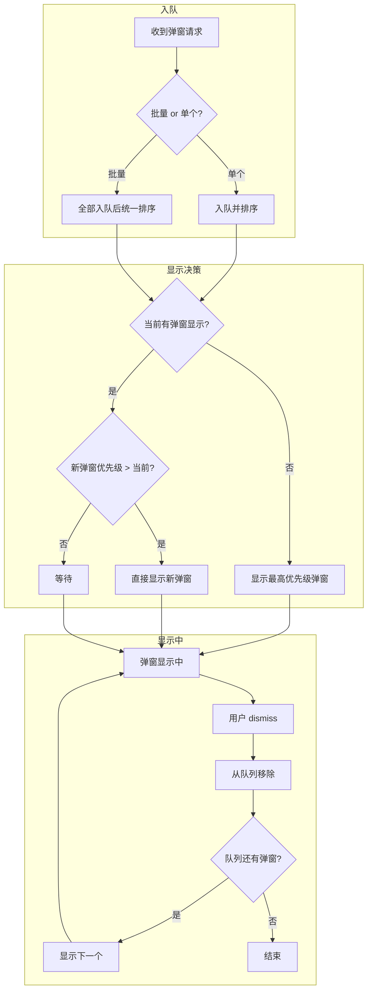

# 弹窗设计规范

本文档记录 CJPopupAction 库的设计规范和实现要点。

---

## 目录

- 一、blankView 传入式设计
- 二、多弹窗堆叠显示颜色设计
- 三、多弹窗堆叠显示顺序设计

---

## 一、blankView 传入式设计

### 设计变更

| 项目 | 旧设计 | 新设计 |
|------|--------|--------|
| 参数 | `blankBGModel:(nullable CJPopupBlankModel *)` | `blankView:(nullable UIView *)` |
| nil 含义 | nil = 创建默认遮罩 | nil = 不添加遮罩 |
| 无遮罩方式 | 无法（内部总是创建） | 传 nil |
| 默认遮罩 | `[CJPopupBlankModel defaultModel]` | `[UIView cj_defaultBlankView]` |
| 自定义遮罩 | 只能改颜色 | 任意 UIView（blur、圆角等） |

### 为什么传入 UIView 而不是内部创建

#### 旧设计的问题

```objc
// 旧设计：内部创建 blankView，外部无法定制
CJPopupBlankModel *model = [CJPopupBlankModel defaultModel];
model.color = [UIColor redColor];  // 只能改颜色
[popupView cj_popupInView:superview ... blankBGModel:model ...];
```

- **无法添加效果**：blur、圆角、自定义子视图等都做不到
- **多一个类**：CJPopupBlankModel 只是一个属性容器，增加了维护成本
- **灵活性差**：只能配置颜色，不能配置视图本身

#### 新设计的优势

```objc
// 新设计：传入预配置的 UIView
UIView *blankView = [UIView cj_defaultBlankView];  // 默认
// 或
UIView *blankView = [UIView cj_blankViewWithColor:[UIColor redColor]];  // 指定颜色
// 或
UIVisualEffectView *blurView = [[UIVisualEffectView alloc] initWithEffect:...];
// 不需要设置 frame，内部会自动设置
// 传入任意 UIView
[popupView cj_popupInView:superview ... blankView:blurView ...];
```

- **完全灵活**：可以传入任意 UIView 子类
- **预配置**：调用前可以完全配置好 blankView
- **无需额外类**：不需要 CJPopupBlankModel
- **nil 语义清晰**：nil = 不添加遮罩

### 为什么不用 CJPopupBlankView 子类

有人可能建议创建一个 `CJPopupBlankView` 类：

```objc
// 不推荐的方案
@interface CJPopupBlankView : UIView
+ (instancetype)defaultBlankView;
+ (instancetype)blankViewWithColor:(UIColor *)color;
@end
```

#### 为什么当前方案更好

| 对比项 | UIView 工厂方法 | CJPopupBlankView 子类 |
|--------|-----------------|----------------------|
| 接受类型 | 任意 UIView | 只接受 CJPopupBlankView |
| 使用 UIVisualEffectView | ✅ 直接传入 | ❌ 需要继承或转换 |
| 使用自定义视图 | ✅ 直接传入 | ❌ 需要继承 |
| 额外类 | 无 | 需要维护 CJPopupBlankView |
| 灵活性 | 完全灵活 | 受限于子类 |

**结论**：UIView 工厂方法更灵活，不需要额外类，是更好的设计。

### 使用方式

#### 1. 不添加遮罩
```objc
[popupView cj_popupInView:superview withOrigin:origin size:size
               blankView:nil ...];  // nil = 无遮罩
```

#### 2. 默认遮罩
```objc
UIView *blankView = [UIView cj_defaultBlankView];
[popupView cj_popupInView:superview withOrigin:origin size:size
               blankView:blankView ...];
```

#### 3. 自定义颜色遮罩
```objc
UIView *blankView = [UIView cj_blankViewWithColor:[UIColor redColor]];
[popupView cj_popupInView:superview withOrigin:origin size:size
               blankView:blankView ...];
```

#### 4. 模糊效果遮罩
```objc
UIBlurEffect *blur = [UIBlurEffect effectWithStyle:UIBlurEffectStyleDark];
UIVisualEffectView *blurView = [[UIVisualEffectView alloc] initWithEffect:blur];
// 不需要设置 frame，内部会自动设置
[popupView cj_popupInView:superview withOrigin:origin size:size
               blankView:blurView ...];
```

#### 5. 自定义遮罩视图
```objc
UIView *customBlankView = [[UIView alloc] init];
customBlankView.backgroundColor = [UIColor blackColor];
// 不需要设置 frame，内部会自动设置
// 添加自定义子视图...
[popupView cj_popupInView:superview withOrigin:origin size:size
               blankView:customBlankView ...];
```

### Window 弹窗的默认行为

对于 `cj_showInCenterWindow:` 和 `cj_showInBottomWindow:`，传 nil 会自动使用默认遮罩：

```objc
// nil = 使用默认遮罩（不是无遮罩）
[popupView cj_showInCenterWindow:animationType withSize:size
                       blankView:nil ...];  // 自动创建默认遮罩
```

这是为了保持 window 弹窗必须有遮罩的行为（避免点击穿透）。

### blankView frame 设置规则

调用方负责设置 blankView 的 frame，库不负责。各调用方的规则：

| 调用方 | frame 计算方式 |
|--------|---------------|
| `cj_showInCenterWindow:` / `cj_showInBottomWindow:` | `keyWindow.frame` |
| `cj_popupInView:withOrigin:size:` | `(0, popupViewOrigin.y, popupSuperview.width, popupSuperview.height - popupViewOrigin.y)` |
| `cj_expandInView:` | `popupSuperview.bounds` |

### 实现要点

1. **空白 View 由调用方创建**：库不负责创建 blankView
2. **frame 由调用方设置**：调用方知道 blankView 该多大
3. **库负责添加到父视图**：添加点击手势、添加到 superview
4. **点击手势自动添加**：无论 blankView 是什么类型，都会添加点击手势
5. **blankView 复用**：通过 `self.cjTapView` 存储，多次弹出时复用

---

## 二、多弹窗堆叠显示颜色设计

### 场景说明

同一个 superview 上同时显示多个弹窗时，每个弹窗持有独立的 blankView，堆叠后会产生视觉叠加效果。

### blankView 堆叠行为

每个弹窗持有独立的 blankView，颜色相同（如 `rgba(0,0,0,0.5)`）。堆叠时多层半透明叠加，视觉上背景会变深——这是半透明叠加的物理效果，不是设计问题。

```
弹窗1 blankView (rgba(0,0,0,0.5))
弹窗2 blankView (rgba(0,0,0,0.5))  ← 视觉上更暗（两层叠加）
弹窗3 blankView (rgba(0,0,0,0.5))  ← 视觉上最暗（三层叠加）
```

### 设计原则

1. **弹窗库不负责队列管理**：库只提供 show/hide 能力，优先级排序和显示顺序由业务层控制
2. **每个弹窗独立持有 blankView**：通过 `self.cjTapView` 关联，互不影响
3. **dismiss 后自然露出下层**：移除顶层 blankView 后，下层 blankView 自然可见

### blankView 颜色控制

所有弹窗使用相同颜色的 blankView，堆叠变深是半透明叠加的自然效果，可接受。业务层无需手动调整 blankView 颜色。

```objc
UIView *blankView = [UIView cj_blankViewWithColor:[UIColor colorWithWhite:0 alpha:0.5]];
```

---

## 三、多弹窗堆叠显示顺序设计

### 场景说明

App 可能同时收到多个弹窗请求（网络错误、定位权限、广告、会员推广等），需要按优先级决定显示顺序，而非按请求到达顺序。

### 设计原则

弹窗库不负责队列管理，只提供 show/hide 能力。优先级排序和显示顺序由业务层控制。

### 业务层实现建议

#### 流程图

**画法一：子图分组**（flowchart+subgraph）



**画法二：状态图**（stateDiagram略）

**画法三：时序图**（sequenceDiagram略）

设计队列管理器 API 时考虑了两个问题：

**第一个问题：为什么传 `showAction`？**

如果队列管理器自己调用 show 方法，就需要把动画类型、尺寸、blankView、showComplete、tapBlankComplete 等参数全部加到 `CJPopupItem` 作为属性。这不合理，因为：

1. 属性太多，`CJPopupItem` 会变得臃肿
2. show API 变化时，`CJPopupItem` 也要跟着改
3. 队列管理器需要关心不同 show 方法的调用方式

所以把 show 逻辑封装成闭包传给队列管理器，它只需要调用 `showAction()` 就行，不需要知道具体细节。

**第二个问题：为什么还要传 `hideAction`？**

如果只传 `showAction`，调用方需要自己执行 hide 动画，完成后调 `dismissTopPopup()` 通知队列管理器。

但这样有个问题：调用方需要知道自己该调哪个 hide 接口。弹窗类型不同，hide 方法不同（`cj_hideFromCenterWindow:`、`cj_hideFromBottomWindow:` 等），调用方在 hide 时可能已经不记得当初用的是哪个 show 了。

所以同样把 hide 逻辑封装成闭包传给队列管理器，`dismissTopPopup()` 时队列管理器自己执行，调用方不需要知道细节。

#### 接口定义

```swift
/// 弹窗队列项
class CJPopupItem {
    let popupView: UIView
    let priority: Int
    let showAction: () -> Void
    let hideAction: () -> Void
    
    init(popupView: UIView,
         priority: Int,
         showAction: @escaping () -> Void,
         hideAction: @escaping () -> Void) {
        self.popupView = popupView
        self.priority = priority
        self.showAction = showAction
        self.hideAction = hideAction
    }
}

/// 弹窗队列管理器
class CJPopupQueueManager {
    /// 弹窗入队（支持单个或多个）
    /// 入队后自动按优先级排序，自动显示当前最应该显示的弹窗：
    /// 1. 当前没有弹窗显示 → 显示最高优先级的弹窗
    /// 2. 新弹窗优先级高于当前 → 显示新弹窗（覆盖在上层）
    /// 3. 新弹窗优先级低于当前 → 等待队列，等当前弹窗 dismiss 后再显示
    func enqueue(_ items: CJPopupItem...)
    /// dismiss 当前弹窗（内部会自动执行 hideAction，调用方不要重复调用 hide 方法）
    func dismissTopPopup()
}
```

其实现参考和使用示例，见 [附：1、队列管理器](#1、队列管理器)


## 附：

<a name="1、队列管理器"></a>

### 1、队列管理器

#### 1.1 实现参考

```swift
class CJPopupQueueManager {
    private var popupQueue: [CJPopupItem] = []
    /// 记录当前正在显示的弹窗优先级，-1 表示没有弹窗显示
    private var currentPriority: Int = -1
    
    // MARK: - 入队
    
    /// 弹窗入队（支持单个或多个）
    /// 入队后自动按优先级排序，自动显示当前最应该显示的弹窗：
    /// 1. 当前没有弹窗显示 → 显示最高优先级的弹窗
    /// 2. 新弹窗优先级高于当前 → 显示新弹窗（覆盖在上层）
    /// 3. 新弹窗优先级低于当前 → 等待队列，等当前弹窗 dismiss 后再显示
    func enqueue(_ items: CJPopupItem...) {
        popupQueue.append(contentsOf: items)
        sortQueue()
        evaluateShow()
    }
    
    /// 按优先级降序排序（优先级高的在前面）
    private func sortQueue() {
        popupQueue.sort { $0.priority > $1.priority }
    }
    
    // MARK: - 显示决策
    
    /// 判断是否需要显示弹窗
    /// 1. 当前没有弹窗显示 → 直接显示最高优先级的弹窗
    /// 2. 新弹窗优先级高于当前 → 直接显示（覆盖在上层）
    /// 3. 新弹窗优先级低于当前 → 等待队列，等当前弹窗 dismiss 后再显示
    private func evaluateShow() {
        guard let topItem = popupQueue.first else {
            return
        }
        
        // 当前没有显示的弹窗，直接显示
        if currentPriority == -1 {
            showNextPopup()
        }
        // 新弹窗优先级高于当前，直接显示（覆盖在上层）
        else if topItem.priority > currentPriority {
            showNextPopup()
        }
        // 新弹窗优先级低于当前，等待队列
        // （什么都不做，等 dismissTopPopup() 后再显示）
    }
    
    /// 显示下一个弹窗
    /// 从队列中取出最高优先级的弹窗，调用其 showAction() 显示
    private func showNextPopup() {
        guard let item = popupQueue.first else {
            currentPriority = -1
            return
        }
        
        currentPriority = item.priority
        item.showAction()
    }
    
    // MARK: - dismiss
    
    /// dismiss 当前弹窗
    /// 内部会自动执行 hideAction，调用方不要重复调用 hide 方法
    /// hideAction 执行完成后自动显示下一个弹窗
    func dismissTopPopup() {
        guard let item = popupQueue.first else {
            return
        }
        
        item.hideAction()
        popupQueue.removeFirst()
        showNextPopup()
    }
}
```

#### 1.2 使用示例

```swift
let queueManager = CJPopupQueueManager()

// 单个入队
let networkErrorItem = CJPopupItem(popupView: networkErrorPopup, priority: 100,
    showAction: {
        networkErrorPopup.cj_showInCenterWindow(.expandToCenter,
                                                withSize: CGSize(width: 300, height: 200),
                                                blankView: UIView.cj_default(),
                                                showComplete: nil,
                                                tapBlankComplete: nil)
    },
    hideAction: {
        networkErrorPopup.cj_hideFromCenterWindow(true)
    }
)
queueManager.enqueue(networkErrorItem)

// 批量入队
let locationPermissionItem = CJPopupItem(popupView: locationPermissionPopup, priority: 80,
    showAction: {
        locationPermissionPopup.cj_showInCenterWindow(.slideToCenter,
                                                      withSize: CGSize(width: 300, height: 150),
                                                      blankView: UIView.cj_default(),
                                                      showComplete: nil,
                                                      tapBlankComplete: nil)
    },
    hideAction: {
        locationPermissionPopup.cj_hideFromCenterWindow(true)
    }
)
let adItem = CJPopupItem(popupView: adPopup, priority: 20,
    showAction: {
        adPopup.cj_showInCenterWindow(.expandToCenter,
                                      withSize: CGSize(width: 300, height: 400),
                                      blankView: UIView.cj_default(),
                                      showComplete: nil,
                                      tapBlankComplete: nil)
    },
    hideAction: {
        adPopup.cj_hideFromCenterWindow(true)
    }
)
queueManager.enqueue(locationPermissionItem, adItem)

// 调用方只需调用 dismissTopPopup()，队列管理器会自动执行 hideAction 并显示下一个
// 不要重复调用 cj_hideFromCenterWindow: 等 hide 方法
// queueManager.dismissTopPopup()
```
